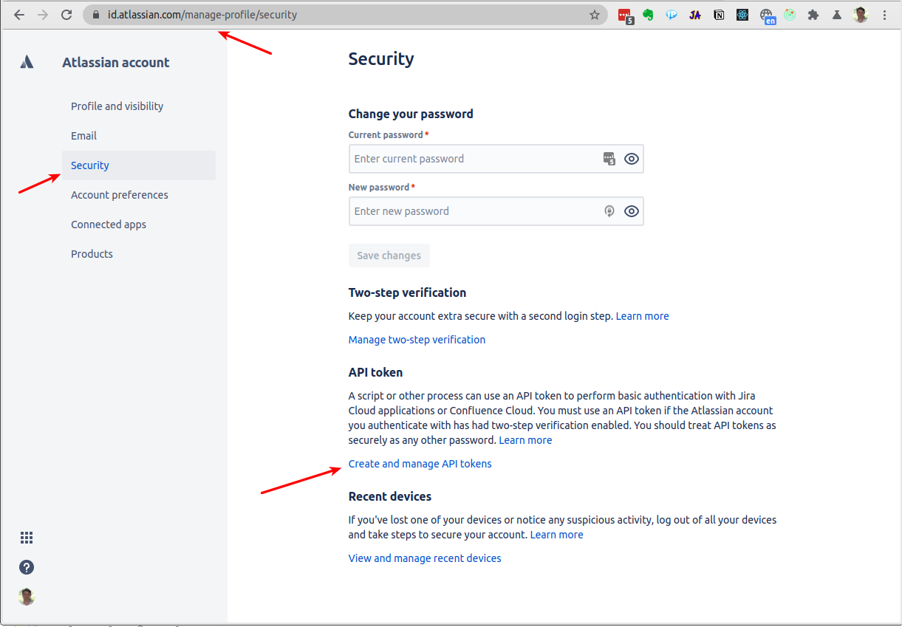
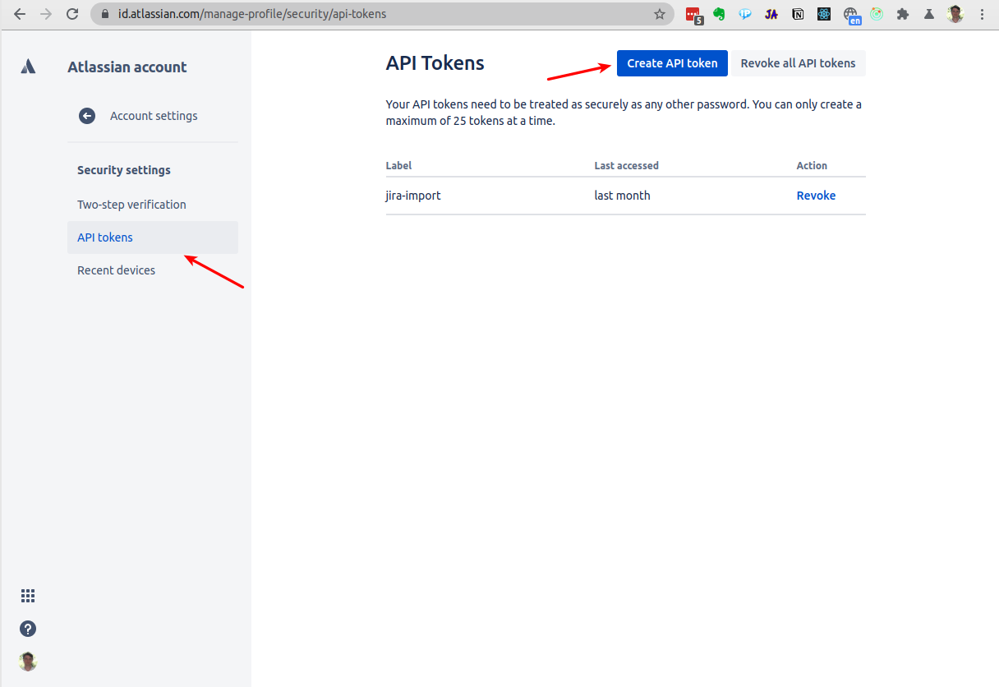
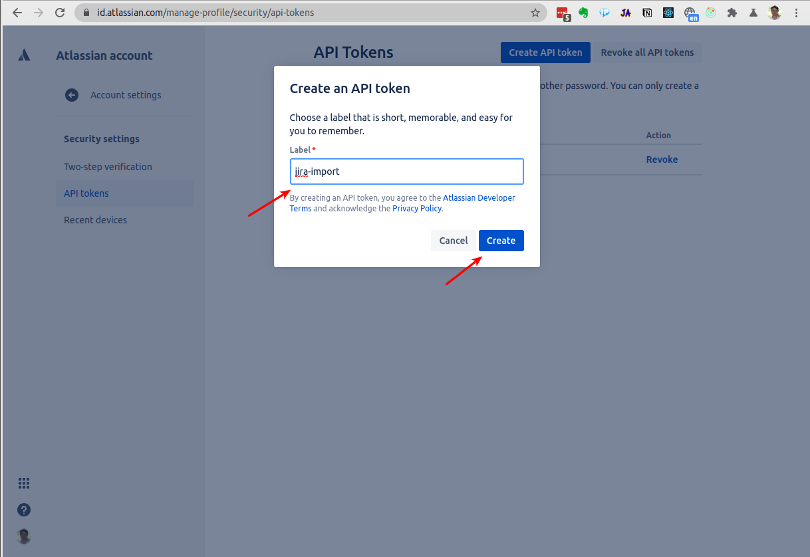

# Jira Create Issues Script

This script helps auto-creation of Epics and Stories out of the CSV file.

Following is how to use the script and what you need to configure.

To execute the script do this:
```bash
./jira_create_issues.py https://<your domain>.atlassian.net MYPRJ ./user-stories.csv
```

* `https://<your domain>.atlassian.net` - is your Atlassian domain - must match the one in the api key file check below
* `MYPRJ` - is the Jira project ID or key
* `./user-stories.csv` - is the file to generate issues in CSV format - check below

## CSV Format

The CSV format is:
```csv
ID,       Component,  Summary,          Priority, Description
E101,     ComponentA, My epic Summary,  P0,       My Epic Description
E101-S01, ComponentA, My story Summary, P1,       My Story Description
```

The epics and story IDs are prepended to the summary.

* The epic ID should be in format `EXYZ` - where `XYZ` is a number - keep the length always to `4`
* The story ID should start with the epic ID and should contain `-S` - this is the code check for a story

The Description could contain new lines with the sequence: `\n`

The priorities mapped like this:
* `P0` - Jira priority: `2`
* `P1` - Jira priority: `3`
* `P2` - Jira priority: `4`

The highest Jira priority `1` is not used and is kept later on to be able to create critically 
and/or blocker tickets that are on top of the epics and stories.

If the priority in the CSV is not one of the `P0`, `P1`, or `P2` the script will use the `P0`.

## Get Atlassian API Token

To use the script you will need an Atlassian API token.

Go to this link once you are successfully logged in to your Jira account:

https://id.atlassian.com/manage-profile/security/api-tokens







Store the token, the username and the Jira URL in a file: 

```bash
~/.jira_api_key
```

The format of the file should be:
```text
https://<your domain>.atlassian.net <your full username email> <the API token>
```

## Install Libraries

These are the Python libraries that need to be used:

```bash
pip3 install jira
```