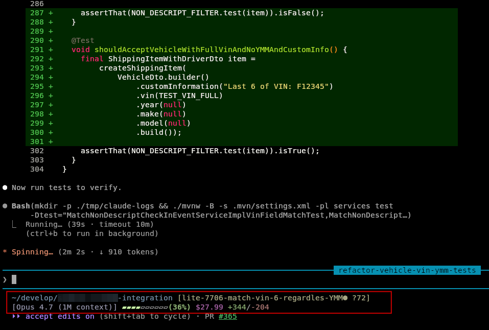

# claude-statusline

A Claude Code `statusLine` command that renders a two-row status
line with the current working directory, full git state, active
model, context-window usage, session cost, session duration, and
lines changed. Each field is prefixed with a compact emoji icon
(📁 🌿 💰 ⏱️ ✏️) so sections are visually scannable at a glance.

## Files

| Path | Purpose |
|---|---|
| `~/bin/claude-statusline.sh` | The statusline script (executed by Claude Code on every update). |
| `~/.claude/settings.json` | Wires the script in via the `statusLine` block. |

## What it shows

Two rows, separated by `\n`:

```
📁~/bin 🌿[master● ?6 ↑2] {submodule:branch✓,...}
[Opus 4.7] ▰▰▰▰▱▱▱▱▱▱(42%) 💰$0.83 ⏱️2h23m ✏️+120/-45
```

Icons sit flush against their values (no gap) so each `icon+value`
reads as a single unit.

Live example (outlined in red):



### Row 1 — path and git

- **📁 cwd** — workspace path with `$HOME` collapsed to `~` (dim
  blue).
- **🌿 git block** `[branch<markers>]` (dim yellow), only when
  inside a git repo:
  - `●` first — staged changes.
  - `●` second — unstaged changes.
  - ` ?N` — count of untracked files.
  - ` ↑N` / ` ↓N` — commits ahead/behind the upstream branch.
- **submodule block** `{name:branch<status>, ...}` — one entry per
  submodule listed in `.gitmodules`. `✓` = clean, `●` = dirty.

### Row 2 — model, context, cost, duration, lines

- **`[model]`** (dim cyan) — `.model.display_name` from the stdin
  JSON.
- **Context bar** — 10 `▰`/`▱` blocks + `(N%)` label, color-coded
  by `.context_window.used_percentage`:
  - green when < 60%
  - yellow when 60–84%
  - red when ≥ 85%
- **💰 `$X.XX`** (dim magenta) — session cost from
  `.cost.total_cost_usd`. Hidden when absent.
- **⏱️ duration** (dim cyan) — wall-clock time since the session
  started, from `.cost.total_duration_ms`. Auto-scales:
  `45s` → `2m5s` → `1h2m`. Hidden when absent.
- **✏️ `+A/-R`** (green/red) — `.cost.total_lines_added` and
  `.cost.total_lines_removed`. Hidden when both are zero.

Everything except cwd is conditional — fields quietly disappear
when their source data isn't in the JSON payload.

## How it works

1. Reads the statusLine JSON payload on stdin (Claude Code pipes it
   on every refresh).
2. Extracts fields with `jq -r` using `// empty` / `// 0` fallbacks
   so missing keys don't produce `null` output.
3. Runs `git --no-optional-locks` for status, untracked count, and
   ahead/behind — the `--no-optional-locks` flag avoids fighting an
   interactive git in another terminal.
4. Computes the context bar as `(pct + 5) / 10` filled blocks
   (rounded), clamped to `[0, 10]`.
5. Emits ANSI-colored text with `printf`. Dim (`\033[2;*m`) for
   neutral info, bold (`\033[1;*m`) for the context bar so it stands
   out.

## Installation

Add a `statusLine` block to `~/.claude/settings.json`:

```json
{
  "statusLine": {
    "type": "command",
    "command": "~/bin/claude-statusline.sh"
  }
}
```

Make sure the script is executable:

```bash
chmod +x ~/bin/claude-statusline.sh
```

Restart Claude Code (or start a new session) for the statusline to
take effect. Use `/statusline` to force a re-render.

## Testing

Pipe a mock JSON payload to the script and inspect stdout:

```bash
echo '{
  "workspace": {"current_dir": "/home/idachev/bin"},
  "model": {"display_name": "Opus 4.7"},
  "context_window": {"used_percentage": 42},
  "cost": {
    "total_cost_usd": 0.83,
    "total_duration_ms": 8580000,
    "total_lines_added": 120,
    "total_lines_removed": 45
  }
}' | ~/bin/claude-statusline.sh; echo
```

Vary `used_percentage` across 0, 59, 60, 84, 85, 100 to verify the
green/yellow/red thresholds.

## Requirements

- `jq` (JSON parsing)
- `git` (branch, diff, `rev-list`, `ls-files`)
- A terminal that renders Unicode blocks (`▰▱●✓`), ANSI colors, and
  emoji presentation for `📁 🌿 💰 ⏱️ ✏️`. Glyphs that default to
  text (stopwatch, pencil) carry the VS16 variation selector so they
  consistently render as emoji.

## Caveats

- **Effort / thinking level isn't shown** — Claude Code doesn't
  expose it in the statusLine JSON yet (tracked upstream in
  anthropics/claude-code issues #31415 and #36187).
- **Multi-line output** — Claude Code renders up to ~4 statusline
  rows. Adding more than two may get clipped depending on the
  terminal.
- **Submodule scan cost** — every render reads `.gitmodules` and
  `cd`s into each submodule to check status. Repos with many
  submodules may see a perceptible delay on each refresh.
- **Context bar rounding** — 1% still shows one filled block (the
  `+5` rounding), and 95%+ all show 10 filled. Intentional, to make
  "starting to fill" and "basically full" visually obvious.
