# ZeroTier + OPNSense + VMWare ESXi VMs

Here we describe how to configure an internal local network
for desired VMWare VMs and access them from local laptop or 
mobile phone via ZeroTier and OPNSense.

## Install OPNSense

Check this video on how to install OPNSense in a VM:

https://www.youtube.com/watch?v=1R9QlMC8bhU

## Install ZeroTier in OPNSense

Check this video on how to install ZeroTier in OPNSense:

https://www.youtube.com/watch?v=qPgcH6T9Tfo

## Setup Internal ESXi Network

Create Virtual Switch:

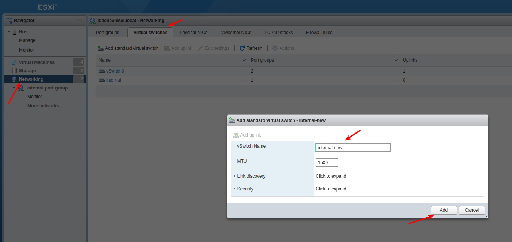

Create a new port group and link it with the new Virtual Switch:

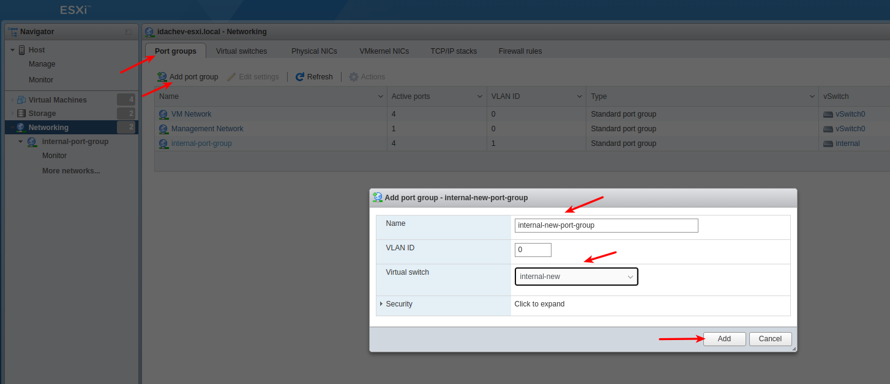

Add a new network adapter and assign it to the new port group for
all VMs that you want to connect within the internal network.

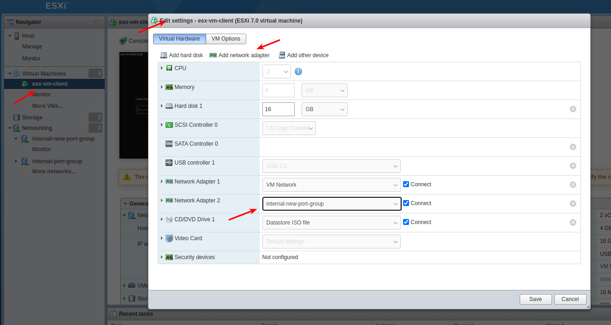

You need to restart each VM after we setup OPNSense DHCP for the
internal LAN to start assigning an IP address to.

## ZeroTier Setup

The ZeroTier network chosen was: `172.22.172.0/24`

Configure auto assign pools: `172.22.172.10` to `172.22.172.254`

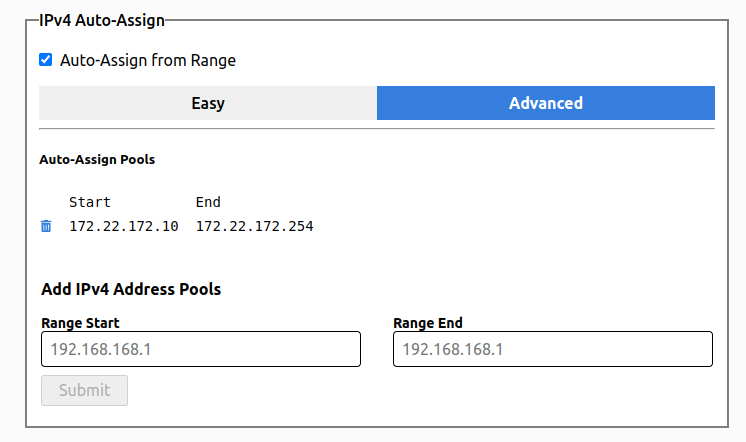

Configure static IP addresses for my laptop and OPNSense VM:

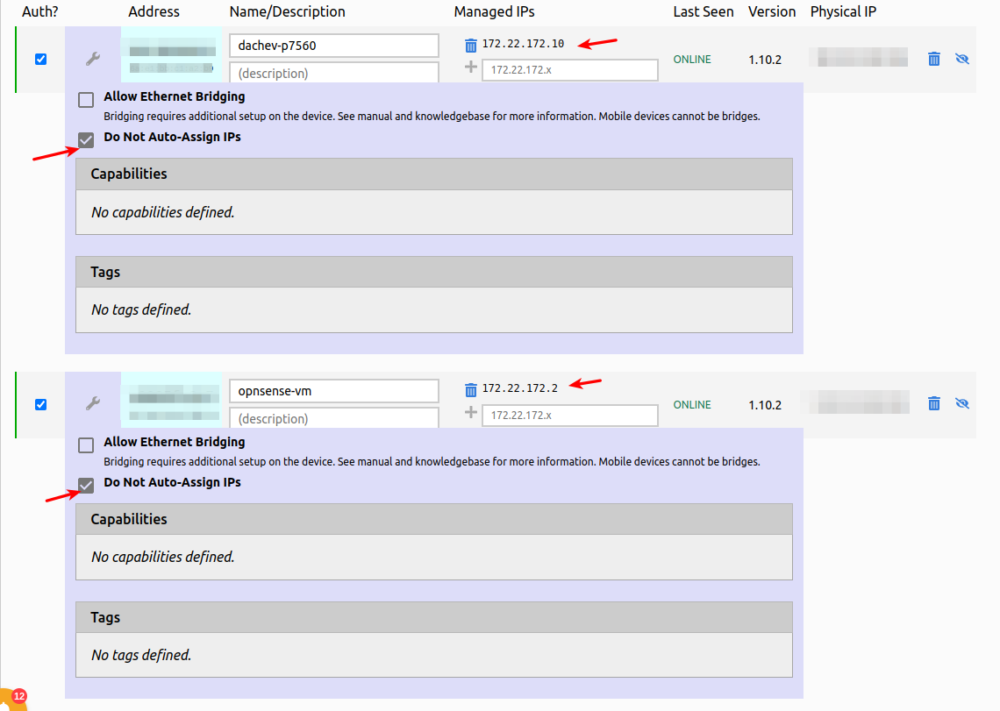

### Adding Custom IPs

You can add a custom IP address that is accessible like the ESX real 
LAN address for example `10.10.11.22` in the ZeroTier static routes.

With this rule `10.10.11.22/32` via `172.22.172.2` - which is the
ZeroTier IP of the OPNSense.

And I can access the ESXi from my laptop or any other ZeroTier client.

## OPNSense Setup

### Setup OPNSense LAN

LAN address and space `192.168.192.1/24`

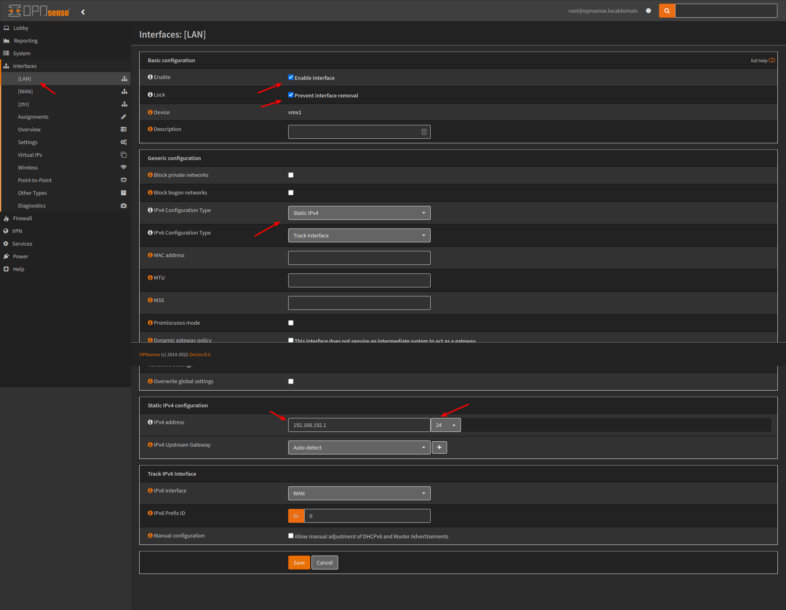

Setup ZeroTier DHCP for LAN and auto assign.

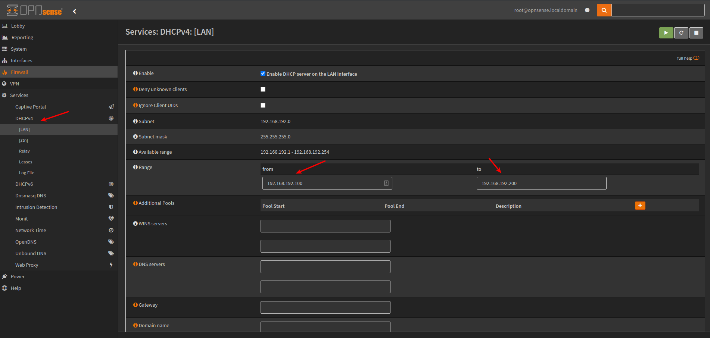

Restart the VMs to get new LAN IPs and make them static assignments:

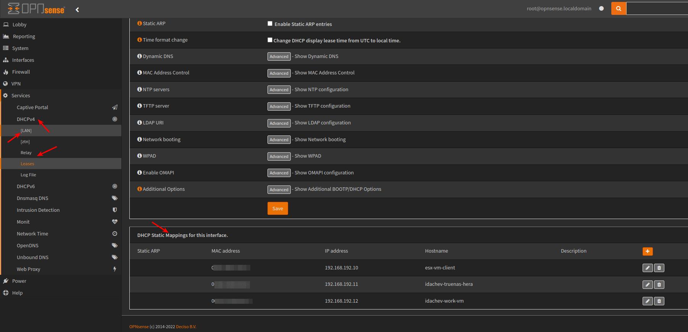

The easiest way to do this is via `Services -> DHCPv4 -> Leases` there is an add button.

### Setup OPNSense ZeroTier

ZeroTier address and space `172.22.172.2/24`

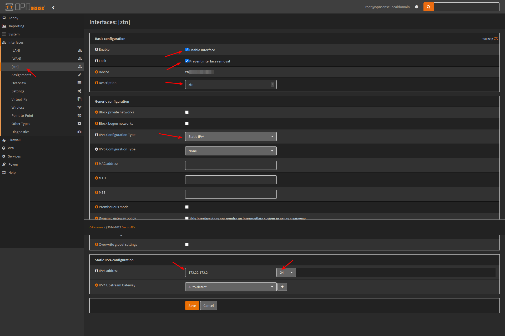

Allow Firewall rule for ZeroTier network.

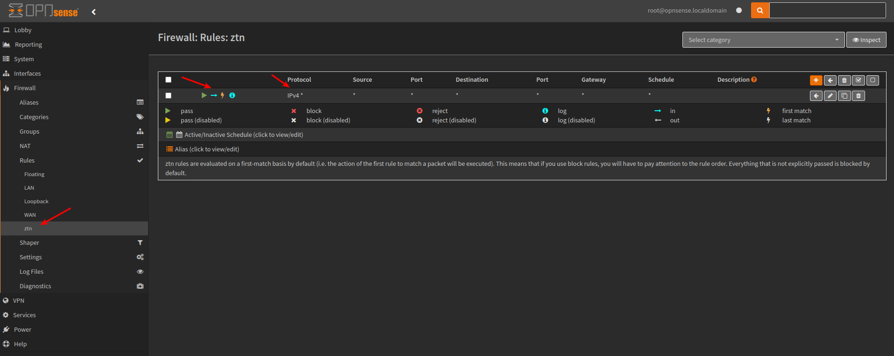

## Static Routs in VMs

The second NIC in each VM is assigned to the internal network managed by OPNSense.

We need to add a static route in order all ZeroTier clients to be able to access
the VMs by their internal network addresses: `192.168.192...`

For Ubuntu based distro add this to: `/etc/netplan/1-network-manager-all.yaml`

```yaml
network:
  version: 2
  renderer: NetworkManager
  ethernets:
    ens192: 
      dhcp4: true
      routes:
      - to: 172.22.172.0/24
        via: 192.168.192.1 
```

Where the `ens192` is the network interface of the internal NIC.

If you have a TrueNAS VM, you can configure the same from:

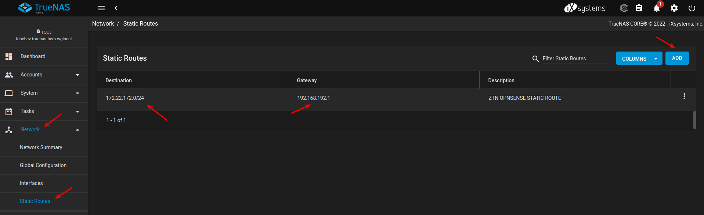
